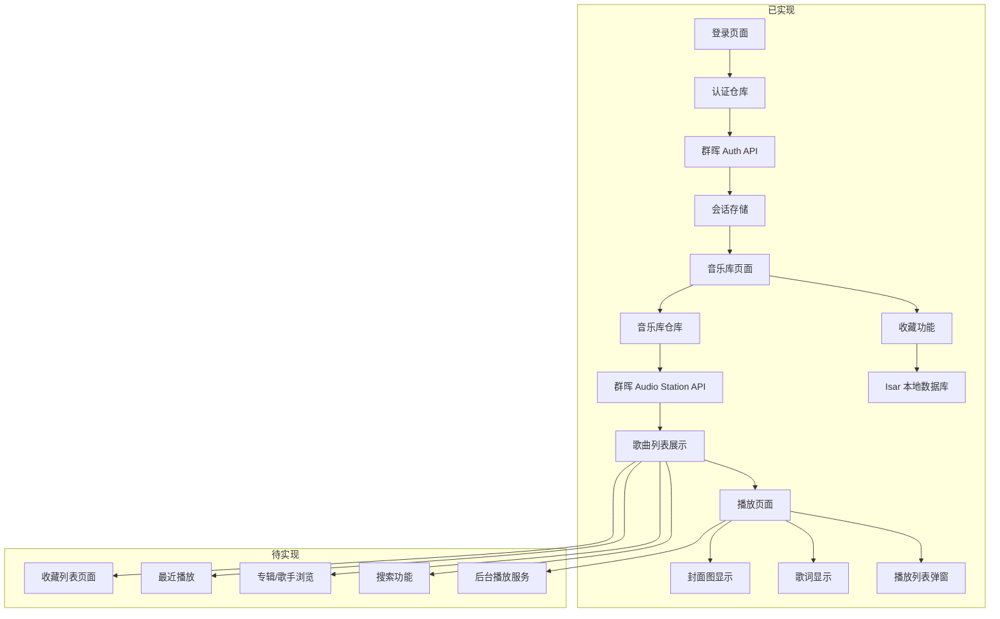

# 群晖音乐播放器项目分析报告

## 项目概述

群晖音乐播放器（Flutter）- 一款基于 Flutter 的跨平台群晖 NAS 音乐播放器应用。

### 核心功能
- 群晖 DSM 登录认证
- 音乐库浏览（专辑、歌手、歌曲）
- 在线播放与控制
- 收藏与最近播放（本地持久化）

## 技术栈

| 类别 | 技术 |
|------|------|
| 框架 | Flutter |
| 语言 | Dart 3.11.3+ |
| 状态管理 | flutter_riverpod |
| 路由 | go_router |
| 网络请求 | dio |
| 本地存储 | shared_preferences |
| 本地数据库 | isar (已移除) |
| 图片缓存 | cached_network_image |
| 日志 | logger |
| 音频播放 | just_audio, audio_service, audio_session |

## 项目结构

```
lib/
  main.dart                 # 应用入口
  core/
    network/                # 网络层
      dio_client.dart       # Dio 客户端封装
      synology_base_api.dart    # API 基类
      synology_api.dart         # API 统一导出
      synology_api_constants.dart   # API 常量
      synology_api_exception.dart   # API 异常
      synology_auth_api.dart    # 认证 API
      synology_audio_station_api.dart  # 音频站 API
  router/
    router.dart             # 路由配置
  models/                   # 数据模型
    auth/                   # 认证相关模型
    library/                # 音乐库模型
      song_item.dart        # 歌曲模型
      favorite_song.dart    # 收藏歌曲模型（使用 SharedPreferences）
      lyrics.dart           # 歌词模型
  services/                 # 数据仓库层
    auth/
      auth_repository.dart
    library/
      library_repository.dart
      favorites_repository.dart  # 收藏仓库
    player/
      audio_player_service.dart  # 音频播放服务
  pages/                    # 页面（UI + Controller）
    login/
      login_page.dart
      login_controller.dart
    home/
      library_page.dart
      library_providers.dart
    player/
      player_page.dart
      player_controller.dart
  widgets/                  # 通用组件
  utils/                    # 工具类
test/                       # 测试目录
```

## 功能实现状态

### ✅ 已实现功能

| 功能模块 | 实现状态 | 说明 |
|---------|---------|------|
| **群晖 DSM 登录认证** | ✅ 完成 | |
| ├─ 登录页面 UI | ✅ | [`login_page.dart`](lib/pages/login/login_page.dart) |
| ├─ 登录控制器 | ✅ | [`login_controller.dart`](lib/pages/login/login_controller.dart) |
| ├─ 会话持久化 | ✅ | 使用 `shared_preferences` 存储 sessionId |
| └─ 登录历史记忆 | ✅ | 自动填充上次登录的服务器和用户名 |
| **音乐库浏览** | ✅ 完成 | |
| ├─ 歌曲列表页面 | ✅ | [`library_page.dart`](lib/pages/home/library_page.dart) |
| ├─ 歌曲数据模型 | ✅ | [`song_item.dart`](lib/models/library/song_item.dart) |
| ├─ API 层 | ✅ | [`synology_audio_station_api.dart`](lib/core/network/synology_audio_station_api.dart) |
| └─ 下拉刷新 | ✅ | 支持 |
| **播放页面** | ✅ 完成 | |
| ├─ 播放控制器 | ✅ | [`player_controller.dart`](lib/pages/player/player_controller.dart) |
| ├─ 歌曲数据传递 | ✅ | 点击歌曲设置播放队列和当前歌曲 |
| ├─ 动态歌曲信息显示 | ✅ | 播放页面显示实际歌曲信息 |
| ├─ 封面图显示 | ✅ | 使用 `cached_network_image` 加载封面 |
| ├─ 播放列表弹窗 | ✅ | 底部弹窗展示播放队列 |
| └─ 歌词显示 | ✅ | LRC 格式解析与同步高亮 |
| **音频播放核心** | ✅ 完成 | |
| ├─ 音频播放服务 | ✅ | [`audio_player_service.dart`](lib/services/player/audio_player_service.dart) |
| ├─ 播放/暂停/切歌 | ✅ | 基础播放控制 |
| ├─ 进度条拖动 | ✅ | 播放进度控制 |
| └─ 播放状态监听 | ✅ | 实时播放状态更新 |
| **收藏功能（部分）** | ✅ 完成 | |
| ├─ 本地持久化存储 | ✅ | 使用 isar 数据库 |
| ├─ 收藏/取消收藏 UI | ✅ | 列表页收藏按钮 |
| └─ 收藏仓库 | ✅ | [`favorites_repository.dart`](lib/services/library/favorites_repository.dart) |

### ❌ 待实现功能

| 功能模块 | 优先级 | 说明 |
|---------|-------|------|
| **收藏功能完善** | 🟡 中 | |
| └─ 收藏列表页面 | 🟡 | 独立页面展示收藏歌曲 |
| **最近播放** | 🟡 中 | |
| ├─ 播放记录持久化 | 🟡 | 记录播放历史 |
| └─ 最近播放列表 | 🟡 | 独立页面展示 |
| **专辑/歌手浏览** | 🟡 中 | API 已实现，缺 UI |
| ├─ 专辑列表页面 | 🟡 | 浏览专辑 |
| ├─ 歌手列表页面 | 🟡 | 浏览歌手 |
| ├─ 专辑详情页 | 🟡 | 专辑内歌曲 |
| └─ 歌手详情页 | 🟡 | 歌手专辑/歌曲 |
| **搜索功能** | 🟡 中 | API 已实现，缺 UI |
| ├─ 搜索框 UI | 🟡 | 输入关键词 |
| └─ 搜索结果展示 | 🟡 | 歌曲/专辑/歌手结果 |
| **后台播放服务** | 🟢 低 | |
| └─ audio_service 集成 | 🟢 | 后台播放与通知栏控制 |

### 📋 实现计划

#### 阶段 1: 播放页面与歌曲列表连接（已完成）
- [x] 修复代码路径错误
- [x] 创建播放控制器管理播放状态
- [x] 实现歌曲点击传递数据到播放页面
- [x] 连接播放页面与实际歌曲数据

#### 阶段 2: 音频播放核心（已完成）
- [x] 添加音频播放依赖（just_audio, audio_service, audio_session）
- [x] 创建音频播放服务
- [x] 集成音频播放服务到播放控制器
- [x] 实现播放/暂停/切歌功能
- [x] 实现进度条拖动
- [x] 实现播放状态监听

#### 阶段 3: 播放页面增强（已完成）
- [x] 获取并显示封面图（cached_network_image）
- [x] 实现播放列表弹窗
- [x] 添加歌词显示（LRC 解析与同步）

#### 阶段 4: 附加功能（进行中）
- [x] 收藏功能仓库层
- [x] 收藏功能 UI（列表页）
- [ ] 收藏列表页面
- [ ] 最近播放
- [ ] 专辑/歌手浏览
- [ ] 搜索功能
- [ ] 后台播放服务集成（audio_service）

## 架构流程图



## 开发注意事项

### 代码规范
- **文件名**: snake_case（如 `login_controller.dart`）
- **类名**: PascalCase（如 `LoginController`）
- **变量/方法**: camelCase（如 `fetchSongs`）
- **Provider**: xxxProvider（如 `authRepositoryProvider`）

### 错误处理
- 网络层抛出 `SynologyApiException`
- Repository 层捕获并转换为业务异常
- Controller 层捕获业务异常，返回用户友好消息

### 状态管理
- Repository: `Provider`（单例）
- Controller: `NotifierProvider`（可变状态）
- 数据获取: `FutureProvider`（异步数据读取）

## 常用命令

```bash
# 安装依赖
flutter pub get

# 代码静态分析
flutter analyze

# 运行测试
flutter test

# 运行应用（调试模式）
flutter run

# 运行应用（指定平台）
flutter run -d windows
flutter run -d chrome

# 构建发布版本
flutter build apk          # Android
flutter build ios          # iOS
flutter build windows      # Windows

# 清理构建缓存
flutter clean
```

---
*最后更新时间: 2026-03-24*
*分析状态: 修复完成 - 移除 isar，改用 SharedPreferences 宻成收藏功能*
